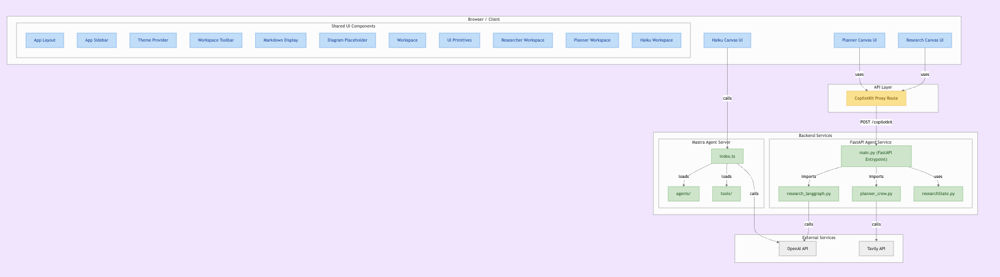

# AGUI Protocol Demo: Research Canvas, Planner Canvas, and Haiku Canvas

This repository is a demonstration of the **AGUI protocol** featuring three interactive demo applications:

- **Research Canvas**: An AI-powered research assistant.
- **Planner Canvas**: An AI-driven project planner.
- **Haiku Canvas**: A creative haiku generator and editor.

The project is organized into two main parts:
- `frontend/`: A Next.js/React-based UI for interacting with the canvases and agents.
- `agent/`: A Python FastAPI backend implementing the AGUI protocol, providing agent logic for research, planning, and haiku generation.

---

## Project Structure

```
.
├── agent/         # Python FastAPI backend with AGUI protocol agents
├── frontend/      # Next.js frontend for the canvas applications and Mastra Agent
└── README.md
```

---

## Demo Applications

### 1. Research Canvas

- **Purpose**: Helps users gather, analyze, and structure research with AI assistance.
- **Features**:
  - Research document editor with agent suggestions.
  - Source management and annotation.
  - Real-time agent insights and progress tracking.

### 2. Planner Canvas

- **Purpose**: Assists in project planning, task management, and team coordination.
- **Features**:
  - Project and task creation, assignment, and prioritization.
  - AI-powered suggestions for planning and task breakdown.
  - Team and deadline management.

### 3. Haiku Canvas

- **Purpose**: A creative space for generating and editing haikus with AI.
- **Features**:
  - Edit and translate haikus (Japanese/English).
  - Visual selection of haiku-related images.
  - Interactive, editable haiku lines.

---

## Getting Started

### Prerequisites

- **Frontend**: Node.js (v18+ recommended), pnpm
- **Agent**: Python 3.12+, [Poetry](https://python-poetry.org/)

---

## Setup Instructions

### 1. Clone the Repository

```bash
git clone https://github.com/ag-ui-protocol/open-ag-ui-canvas
cd open-ag-ui-canvas
```

---

### 2. Frontend Setup

```bash
cd frontend
pnpm install
```

#### To run the frontend (Next.js):

```bash
pnpm run dev
```

---

### 3. Agent Setup

```bash
cd agent
poetry install
```

#### Required API Keys

1. Create a `.env` file in the `agent` directory with the following keys:
```
OPENAI_API_KEY=your_openai_api_key
TAVILY_API_KEY=your_tavily_api_key
```

2. Create a `.env` file in the `frontend` directory with the following keys:
```
OPENAI_API_KEY=your_openai_api_key
REMOTE_ACTION_URL=http://0.0.0.0:8000/copilotkit
NEXT_PUBLIC_REMOTE_ACTION_URL_MASTRA=http://localhost:4111
```

#### To run the Python agent server (for Research and Planner Canvases):

```bash
poetry run python main.py
```
This runs the FastAPI backend server that powers:
- Research Canvas using LangGraph
- Planner Canvas using CrewAI

#### To run the Mastra agent server (for Haiku Canvas):

```bash
# Need to be inside frontend directory
cd frontend
pnpm run dev:agent
```
This runs the Mastra agent server that powers:
- Haiku Canvas using Mastra AGUI framework


---

## Project Details

- **AGUI Protocol**: This demo showcases the AGUI protocol for agent-driven UI applications.
- **Tech Stack**:
  - **Frontend**: Next.js, React, TailwindCSS, CopilotKit, Mastra AGUI
  - **Backend**: FastAPI, LangGraph, CrewAI, CopilotKit Python SDK

---

## Architecture



---

## Contributing

Feel free to open issues or pull requests for improvements, bug fixes, or new features!

---

## License

[MIT](LICENSE) (or specify your license here)

---

**Note:** This is a demo repository. For production use, review security, environment variables, and deployment best practices.
